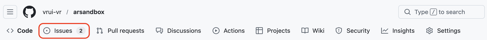

# Contributing to Vrui

First off, thank you for taking the time to contribute!

This guide explains how outside contributors can report issues, submit fixes, create feature branches, and open PRs. Following these steps keeps contributions predictable and reviewable, and makes it easier for us (the Vrui maintainers) to review and merge your work.

See the [Table of Contents](#table-of-contents) for details regarding how Vrui contributions are handled. Please make sure to read relevant sections before making your contribution. We look forward to your contributions!

## Table of Contents

- [Contributing to Vrui](#contributing-to-vrui)
  - [Table of Contents](#table-of-contents)
  - [Asking Questions](#asking-questions)
  - [Requesting Changes](#requesting-changes)
    - [Reporting Bugs](#reporting-bugs)
    - [Suggesting Enhancements](#suggesting-enhancements)
      - [Before Submitting an Enhancement Suggestion:](#before-submitting-an-enhancement-suggestion)
      - [When Submitting an Enhancement Suggestion:](#when-submitting-an-enhancement-suggestion)
    - [Documentation Updates](#documentation-updates)
  - [Forking and Branching](#forking-and-branching)
  - [Making changes](#making-changes)
  - [Creating a Pull Request](#creating-a-pull-request)
    - [Linking Pull Requests to Issues](#linking-pull-requests-to-issues)
    - [PR Reviews and Merges](#pr-reviews-and-merges)
  - [Style Guide](#style-guide)
  - [Attributions](#attributions)

## Asking Questions

Before asking a question:
- Search for existing issues in relevant repositories that might help you. If you have found a suitable issue and still need clarification, you can write your question in the comments of issues.

> [!TIP]
> If you're searching for issues, check out the Issue page in each relevant repository on GitHub. 

- Search for existing posts in the Discussions forum of relevant repositories.

> [!TIP]
> If you're searching for discussions, check out the Discussions page in each relevant repository on GitHub. 

If you you still need clarification and would like to ask a question, please do so in the Discussion forum.

> [!TIP]
> If you're unsure whether to open a Discussion or an Issue, read the following guidelines. Use Discussions for general questions, such as how or why a feature works, or how to use or get started with Vrui. Use Issues for feature requests and bug reports. A quick rule of thumb: if your topic requires changes to code by Vrui maintainers, open an Issue; otherwise, start a Discussion.

- Open a Discussion.
- Provide as much context as possible regarding the problems you're running into.
- Provide OS and version details if applicable.

Maintainers will respond to your discussion as soon as possible.

## Requesting Changes

### Reporting Bugs

Before opening a bug report, please make sure:

- You are using the latest version. If not, update to the latest `dev` branch and confirm that the bug still occurs.
- The bug is not caused by a misconfiguration or incompatible environment components/versions.
- The bug has not already been reported (check existing Issues and relevant online discussions).

> [!WARNING]
> Do not report security related problems, vulnerabilities or bugs including sensitive information as issues or elsewhere in public.

To submit a bug:

1. Open an Issue.
2. Explain the behavior you would expect and the actual behavior.
3. Describe the *reproduction steps* that someone else can follow to recreate the bug on their own. This usually includes your code. Good bug reports isolate the problem and include a reduced test case.
4. Include any error messages or stack traces.
5. Include relevant system details.

Once the bug is filed:

- The project team will label the issue accordingly.
- After submission, maintainers will triage and address your issue. Keep an eye out for requests for more info, especially if we need help reproducing your bug!

### Suggesting Enhancements

#### Before Submitting an Enhancement Suggestion:

- Read the documentation to confirm that the functionality does not already exist.
- Check if the enhancement has already been suggested in Issues. If it has, add a comment to the existing issue instead of opening a new one.
- Consider whether your suggestion fits Vrui's scope and goals.

#### When Submitting an Enhancement Suggestion:

Similar to reporting bugs, enhancement suggestions belong in GitHub Issues.

- Use a clear, descriptive title for the issue to identify the suggestion.
- Describe the current behavior and a step-by-step description of the suggested enhancement. At this point you can also tell us which alternatives do not work for you.
- Explain why the enhancement would be useful to most contributing users.

### Documentation Updates

Small documentation fixes can be included in any PR that touches relevant code. Keep documentation consistent with code, updating examples and CLI commands when you change functionality.

## Forking and Branching

> [!NOTE]
> Angle brackets `<>` in commands below are placeholders, meaning that you have to replace everything between, and including, the angle brackets with some text that depends on your specific circumstances.

1. From the [Vrui GitHub](https://github.com/vrui-vr), navigate to the repository you would like to work on and fork (`Fork` button in top-right)

2. Clone your fork locally:
```sh
git clone https://github.com/<your-username>/<repo>.git
cd <repo>
```

3. Add the original repo as upstream and make sure your fork is up-to-date with the origin:
```sh
git remote add upstream <original-repo-url>
git fetch upstream
git merge upstream/main
```
<!-- Or: https://github.com/vrui/<repo>.git -->

4. Create a branch on your fork, from origin/main.
```sh
git checkout -b <issue-number-description>
```

Each branch and subsequent pull request should fix only one issue.

> [!NOTE]
> Use descriptive branch names, starting with the issue number and followed by a short description. This helps reviewers trace work back to issues.

## Making changes

Make small, focused commits with clear messages. Update or add documentation when functionality changes.

To push your branch to your fork:

```sh
git add .
git commit -m "<issue-number>: short description of change"
git push origin <issue-number-description>
```

## Creating a Pull Request

1. Go to your fork on [GitHub](github.com) and click `Compare & pull request`.
2. Set the target branch to the `dev` branch of the Vrui repository you're contributing to.
3. Use a clear PR title and a descriptive body that explains:
    - What you changed
    - Why it is needed
    - Any user-facing changes
    - Testing instructions or reproduction steps
4. If your change fixes or is related to an issue, link the issue in the PR .
5. Ensure documentation is updated when applicable.

### Linking Pull Requests to Issues

If you are fixing an existing issue, your PR should link to the issue.

One simple way to accomplish this is to reference specified keywords in your commit message. Supported keywords include:
- `close`
- `closes`
- `closed`
- `fix`
- `fixes`
- `fixed`
- `resolve`
- `resolves`
- `resolved`

An example commit message using one of these linking keywords:
```
Closes #<issue-number>
```

This message links your PR to a specific issue and will close the issue when the PR is merged by Vrui maintainers.

> [!NOTE]
> For more detailed instructions and alternative issue linking methods, please refer to the following GitHub guide: [Linking a pull request to an issue](https://docs.github.com/en/issues/tracking-your-work-with-issues/using-issues/linking-a-pull-request-to-an-issue)

### PR Reviews and Merges

PRs are reviewed by the Vrui organization maintainers and once approved, will be merged into main for deployment (after CI passes).

## Style Guide

Generally, follow the existing code style and conventions used throughout repositories. When in doubt, emulate the surrounding code.

## Attributions

Portions of this text are derived from [contributing.md](https://contributing.md/example/).
