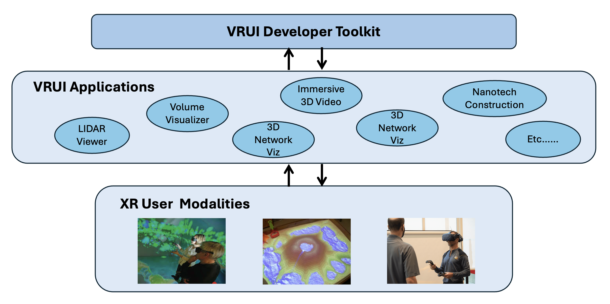

## What is VRUI?

VRUI is both a collection of software and a community of XR developers and scientific investigators and educators who use XR for research and teaching. 

**The VRUI Developer Toolkit** The Vrui Toolkit is a comprehensive development framework designed to facilitate the creation of immersive virtual reality applications. It provides a suite of tools and libraries that enable developers to build VR software with advanced 3D user interfaces, supporting a wide range of input devices and display systems. Vrui emphasizes flexibility and scalability, making it suitable for applications in scientific visualization, data exploration, and other fields requiring interactive 3D environments. 

**VRUI Applications** are applications developed using the Developer Toolkit and deployed as part of VRUI installation to provide specific XR experiences.  For example, the [LIDAR Viewer](https://github.com/vrui-vr/lidarviewer) is an interactive application for processing,
visualization, and analysis of large 3D point cloud data
produced by terrestrial or airborne LiDAR scanning.  Links to the repositories of VRUI applications that are released as Open Source Software (OSS) and whose develper(s) commit to upholding the [VRUI Code of Conduct](https://github.com/vrui-vr/.github/blob/main/CODE_OF_CONDUCT.md) appear in VRUI Organizations lit of repositories on this page.  

**The VRUI Community** is the entire community of VRUI users and developers.  (As of March, 2025, we are aware of approximately 2,000 VRUI users). Please see our [Code of Conduct](https://github.com/vrui-vr/.github/blob/main/CODE_OF_CONDUCT.md) for detialed information about VRUI values and standards.   

## VRUI Framework Architecture

As noted above, VRUI software elements fall into one of two classes:  1) The VRUI Developers Toolkit (the VRUI Core); and 2) VRUI applications.  

The VRUI Devloper Toolkit provides a base level of computational elements that provide abastracted access to specific computational, display, and input/output hardware devises.  

VRUI Applications provide specific XR user experineces such as, for example, immersive 3D video experiences, the ability to inhabit a scene created from LIDAR data, or a virtual meeting room.  User experiences are managed and delivered via VRUI applications, which pass information between the VRUI Developer toolkit and XR devices.

## VRUI Developer Toolkit Architecture

VRUI supports the development of correct, portable, and usable applications across various environments, from desktop systems to CAVEs or head-mounted displays, and Augmented Reality systems.

The primary task of a virtual reality (VR) development toolkit is to shield an application developer from the particular configuration of a VR environment such that applications can be developed quickly and in a portable and scalable fashion across multiple XR environments. Three important parts of this overarching goal are encapsulation of the display environment, encapsulation of the distribution environment, and encapsulation of the input device environment.

### Display abstraction
A toolkit should provide OpenGL rendering contexts that are set up in such a fashion that rendering a model in user-specific coordinates will display that model on all rendering surfaces (monitors, screens, head-mounted displays) in correct head-tracked stereographic mode.

### Distribution abstraction
As larger VR environments require more than one computer to operate, the detail aspects of distribution (number of computers, connection topology, etc.) should be hidden by the toolkit. In principle, there are at least three ways to distribute a rendering environment: 

- **Split first**: An application is replicated on all computers and synchronized by distributing input device and ancillary data.
- **Split middle**: A shared data structure, e.g., a scene graph, is used to transmit data from one application computer to all rendering computers.
- **Split last**: The OpenGL API call stream is broadcast from one application computer to all rendering computers, e.g., using Chromium.

A toolkit should also hide the difference between a distributed rendering environment running on a cluster of individual computers and one running on a shared-memory multi-CPU computer with several independent graphics pipes.

### Input abstraction
There are a wide variety of different vendors, models, and protocols to connect VR input devices such as space balls, space mice, 6-DOF trackers, wands, data gloves, etc., to the computers comprising a VR environment. A toolkit must hide these differences in hardware and provide a uniform view of the set of connected input devices. Furthermore, a toolkit should provide mechanisms not only to hide the hardware details of the input device environment but also the number and configuration of input devices.

An application should be written without aiming for a particular input environment (such as "CAVE wand and head tracker" or "stylus, two pinch gloves, and head tracker"). Instead, the toolkit should provide a layer that allows an application to specify its input requirements at a higher level and allows a user to map input devices to these requirements.

For example, an application might offer a tool to grab an application-specific object and move it, and the user might ask the Vrui toolkit, at run-time, to bind that tool to, say, the trigger button on the right-hand VR controller.

Most existing VR toolkits cover the first aspect well; some VR toolkits cover the second aspect by using any one of the listed distribution schemes, but no toolkit we found covers the third aspect.

## VRUI Application Architecture

VRUI applications that interact witht the VRUI Developer Toolkit to provide fully scalable and portable applications that run on a range of VR environments starting from a laptop with a touchpad, over desktop environments with special input devices such as space balls, to full-blown immersive VR environments ranging from a single-screen workbench to a multi-screen tiled display wall or CAVE to modern commodity head-mounted displays such as HTC Vive or Valve Index.

Applications using the Vrui VR toolkit are written without a particular input environment in mind, and Vrui-enabled VR environments are configured to map the available input devices to application functions such that the application appears to be written natively for the environment it runs on.

## Documentation and Support

We are currently in the process of migrating the VRUI Developer Toolkit and all VRUI applications from it's original CVS reporository to GitHub.  When our migration is complete, independent user and contriburor documentation, support files, and disucssion boards will be associeted directly with each VRUI Organization repository. 

During this migration, the original, combined VRUI documentation and help forums can be access at the [VRUI Toolkit Overview and Documentation Website](https://web.cs.ucdavis.edu/~okreylos/ResDev/Vrui/).

<!--

**Here are some ideas to get you started:**

🙋‍♀️ A short introduction - what is your organization all about?
🌈 Contribution guidelines - how can the community get involved?
👩‍💻 Useful resources - where can the community find your docs? Is there anything else the community should know?
🍿 Fun facts - what does your team eat for breakfast?
🧙 Remember, you can do mighty things with the power of [Markdown](https://docs.github.com/github/writing-on-github/getting-started-with-writing-and-formatting-on-github/basic-writing-and-formatting-syntax)
-->
